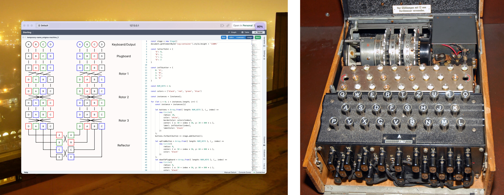

# Enigma Machine

## Introduction

The Enigma machine was used by Germany in World War II to encrypt and decrypt messages. The Allies, led by Alan Turing, were able to "crack" the enigma machine and read the German's messages, an achievement which is credited with greatly shortening and maybe even changing the outcome of the war. In this project, we modeled the Enigma machine with Forge and used our model to demonstrate important properties. Namely, we show that decryption a message is the same as "encrypting" the ciphertext, and that no letter is encoded as itself. The latter is a cryptographic weakness that the Allies were able to use to break the Enigma machine.

## Background

The Enigma machine is a substitution cipher, but after every input the substitution changes. This is implemented by passing letters through a sequence of permutations; the most common setup used a plugboard, three rotors, and a reflector. To encrypt or decrypt a message, the sender and recipient must agree on a starting configuration for the plugboard and rotors.

After inputting each letter, one or more of rotors rotates, resulting in a new permutation to change. This means that traits of the plaintext language are not present in the ciphertext (e.g., the repeated letters in BOOK wouldn't be repeated after encryption).

In the actual machine, the reflector sends the letter through the encryption process again in reverse. In our model, the reflector is a special fixed permutation where if a letter x maps to a letter y through the plugboard and rotors, then y maps to x after going through the reflector. This is important because it allows for decryption. Lastly, the plugboard is an easily-configurable permutation that makes messages more difficult to decode—the rotors are physical components that can be swapped, but with, compared to the plugboard, greater effort and limited entropy.

When a key is pressed, the letter goes through:

1. the plugboard
2. the three rotors, in order
3. the reflector (the three rotors in reverse order)
4. the plugboard

## Models and Visualizations

Our models represent the encryption of a single letter. We use `Int` to represent letters. Our model works for any size integer, but the running time quickly becomes an issue. The basic structure in our model is `Permutation`, which is an abstract sig that represents a bijective mapping of letters. We also have sigs for each of the three rotors, the plugboard, and the reflector. Each of these is a `Permutation` with some extra properties—the rotors have no fixed points, the plug board is symmetric, and the reflector is both.

Lastly, we have an `Encryption` sig, which is also a `Permutation` that maps each letter to what it encrypts to at that point in time. We require the encryption to respect the structure of the Enigma machine. There is only one possible encryption for a given Enigma machine so the encryption is completely defined by the Enigma machine. We also included a visualization that shows how a letter moves through the sequence of permutations and what it is ultimately encoded as.

## Proving Properties

We use our model to prove two important properties of the Enigma machine:

### Symmetry

If a letter x encrypted to a letter y, then letter y encrypts to x. This is important because it allows the Enigma machine to decrypt messages with the same process they are encrypted.

### No Fixed Points

No letter can encode as itself. This property turned out to be a weakness of the Enigma machine that helped the Allies crack it—if a plaintext letter mapped to itself in ciphertext, it would be impossible for the plaintext to be a valid message.

## Modeling Decisions

Our biggest limiting factor when designing our model was runtime. Even at a 2-bit integer size, the model takes about 30 seconds to run, even with the Glucose solver.

Originally we wanted to model encrypting an entire word. This would have entailed having the rotors rotate after each letter and the encryption being a map from integers to maps instead of being a single map. Although this would have been nice to have, it wasn't necessary to prove either of the properties we are interested in and it seemed to greatly increase the runtime. Once the original state of the Enigma machine is set, everything else is deterministic so it should be possible to make this work if one really wanted to. However, this felt more in the spirit of a programming language than forge so we opted against trying to make it work.